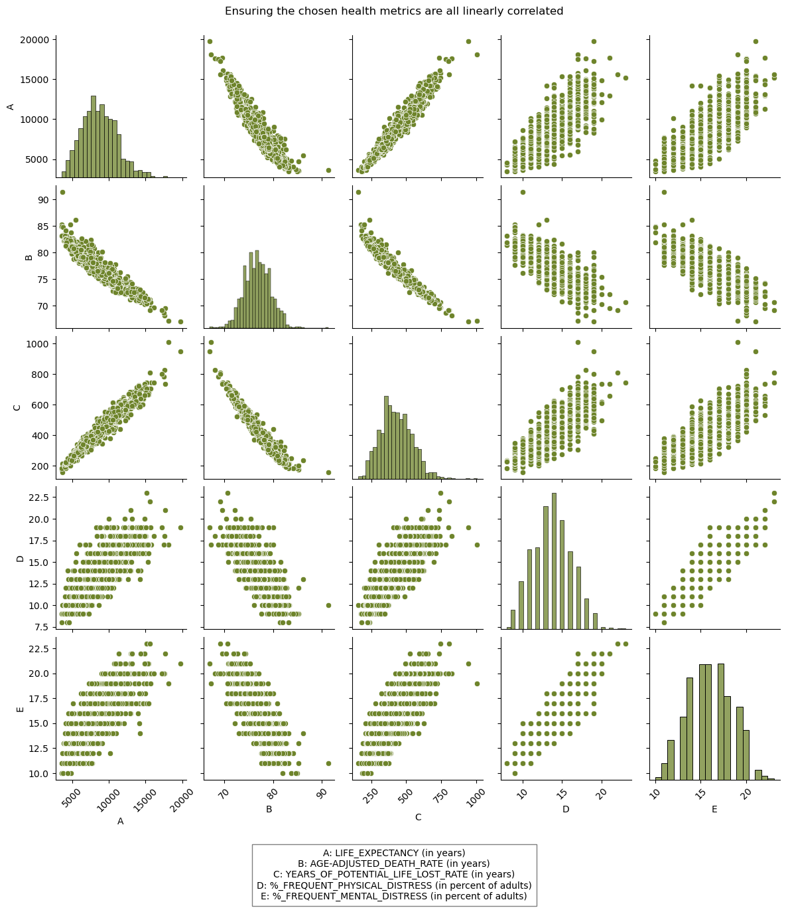

# Methods
Our project focused on two main goals:

1. Engineer an “overall” health metric to detect what variables influence health as a whole.
2. Discover how access to care impacts life expectancy, infant mortality, and mortality.

See below for a thorough explanation of how we accomplished both goals.

## Goal 1: Engineer an “overall” health metric to detect what variables influence health as a whole.
### Overview
```{mermaid}
flowchart LR
  A(1. Create Dataset) --> B(2. Scale Dataset)
  B --> C(3. Select all Health-\nRelated Variables)
  C --> D(4. Project those health \nmetrics to the first eigenvalue)
  D --> E(5a. Assess contribution of \neach health variable)
  D --> F(5b. Assess projection value \nof all other variables)
  D --> G(5c. Assess projection value by \ncounty then average by state)
```

### More detailed explanation {#sec-goal1-details}
1. Gather our entire dataset (not just access to care related variables). Drop all NAs and variables related to count data (we kept only rates and percentages). See [@sec-s_table_1] for a list of all variables used.
2. Preprocess the dataset using StandardScaler and OneHotEncoder to the appropriate columns (numeric and categorical, respectively). This converts our data to completely similarly scaled numeric data to ensure equal contributions from each variable to the final output.
3. Select the following variables to summarize health: `LIFE_EXPECTANCY`, `AGE-ADJUSTED_DEATH_RATE`, `YEARS_OF_POTENTIAL_LIFE_LOST_RATE`, `%_FREQUENT_PHYSICAL_DISTRESS` and `%_FREQUENT_MENTAL_DISTRESS`. `AGE-ADJUSTED_DEATH_RATE`, `YEARS_OF_POTENTIAL_LIFE_LOST_RATE` both represent mortality rates. `%_FREQUENT_PHYSICAL_DISTRESS`, `%_FREQUENT_MENTAL_DISTRESS` represent the percent of adults who report having 14 or more days of poor physical and mental health, respectively, per month. We chose these variables for multiple reasons:
    i) As stated previously, life expectancy, mortality, and infant mortality are common metrics used to assess the health of a population.[⁸](#ref8) Note we dropped infant mortality due to its high rate of NAs.
    ii) Percieved health, as measured by `%_FREQUENT_PHYSICAL_DISTRESS` and `%_FREQUENT_MENTAL_DISTRESS`, also has an impact on one's actual health.
    iii) We confirmed the linear relationship between each of these variables in a pair-plot (see <a href="./Figures/pairplot.png" title="Figure 2">Figure 2</a>), confirming their interconnectedness and validity in using as a summarized health metric.



4. Project desired health variables to the first eigenvalue.

::: {.callout-note collapse="true"}
#### How did we project some variables to the first eigenvalue?
```
pca_all = Pipeline([('transfomer', transformer_all), #need to use transfomer since have both categorical and numeric data
                         ('pca', PCA(1))]) #only project to first one

pca_all.fit(ds_no_nan)

# Extract the PCA components
pca_components = pca_all['pca'].components_

# Get the first eigenvalue component
first_eigenvalue_component = pca_components[0]

# Select the columns to project
columns_to_project = ['YEARS_OF_POTENTIAL_LIFE_LOST_RATE','LIFE_EXPECTANCY', 'AGE-ADJUSTED_DEATH_RATE', '%_FREQUENT_PHYSICAL_DISTRESS', '%_FREQUENT_MENTAL_DISTRESS']

# Assuming X_train_all is a DataFrame
selected_columns = ds_no_nan[columns_to_project]

# Transform the selected columns using the first eigenvalue component
projected_values = selected_columns.dot(first_eigenvalue_component[:len(columns_to_project)])
```
:::

5. Assess contributions and projection values of variables and states.
    i)  Assess contribution of each health variable by multiplying the corresponding element from the first eigenvalue by each of the selected columns and then summing each columns' products. `YEARS_OF_POTENTIAL_LIFE_LOST_RATE` contribued the most by a very large margin (see <a href="./Figures/first_pc_contributions.png" title="Figure 3">Figure 3</a>).
    ii) Assess projection values of all other variables through a very similar process as the above point. We removed the selected columns first, then multiplied the corresponding first eigenvalues by the mean value of each other variable. We plotted the five variables contributing the most and least to the projection (see <a href="./Figures/overall_health_all_variables.png" title="Figure 4">Figure 4</a>).
    iii) Assess projection value by county in a very similar manner as above. We then averaged and mapped by state to visualize a geographic trend with our engineered health metric. We used Python for the projection analysis and R for the visualization See <a href="./Figures/state_projection.png" title="Figure 5">Figure 5</a> for the map and the below section for the map code.

::: {.callout-note collapse="true"}
# How did we assess the contribution of each health variable to the projection?
```
# Extract the PCA components
pca_components = pca_all['pca'].components_

# Get the first eigenvalue component
first_eigenvalue_component = pca_components[0]

# Select the columns to project
columns_to_project = ['YEARS_OF_POTENTIAL_LIFE_LOST_RATE','LIFE_EXPECTANCY', 'AGE-ADJUSTED_DEATH_RATE', '%_FREQUENT_PHYSICAL_DISTRESS', '%_FREQUENT_MENTAL_DISTRESS']

# Calculate the contribution of each variable to the projection
contributions = selected_columns.multiply(first_eigenvalue_component[:len(columns_to_project)], axis=1)

# Sum the contributions for each variable across all data points
total_contributions = contributions.sum()

# Create a DataFrame for visualization
contributions_df = pd.DataFrame({
    'Feature': columns_to_project,
    'TotalContribution': total_contributions
})
```
:::

::: {.callout-note collapse="true"}
# How did we map the projections by state?
```
# Read in the data from python
st = read_csv("mean_projection_state.csv")

# Read in the state data from an installed package
states <- usmap::us_map()

# Merge the datasets
states = states %>%
mutate(state_name = full)%>%
left_join(st)

# Map
state_projection = states %>%
ggplot(aes(x,y,group=group)) +
    geom_polygon(aes(fill = Projection), color = "black") +
    theme_classic() +
    coord_fixed()+
    scale_fill_viridis()+
    labs(subtitle = "Geographic differences in the first principle component, which is\nmost aligned with `Years of Potential Life Lost`",
        title="Southern states are more unhealthy than northwestern states") +
    theme(legend.position = "bottom") +
    theme(
    axis.text =element_blank(),
    axis.title = element_blank(),
    axis.ticks = element_blank(),
    axis.line = element_blank(),
    panel.background = element_rect(fill='transparent'),
    plot.background = element_rect(fill='transparent', color=NA),
    legend.background = element_rect(fill='transparent')    
    )
```
:::

::: {.callout-note collapse="true"}
#### Further description on the tools and models used:
#### Data Preprocessing Tools
|**Name**                    |**Explaination**                                                                                                                                      |
|----------------------------|------------------------------------------------------------------------------------------------------------------------------------------------------|
|*Standard Scaler*           |Standard Scaler is a tool you can use in machine learning to standardize all numeric inputs so the model can correctly assess the impact of each value.|
|*One Hot Encoder*           |Similar to Standard Scaler, One Hot Encoder is a method use to convert character data to numeric in a standardized way so the model can weigh the impact of character input along with numeric.|

#### Unsupervised Dimension Reduction Model
|**Name**                    |**Explaination** 
|----------------------------|-----------------------------------------------------------------------------------------------------------------------------------------------------|
|*PCA*                       |Principle Component Analysis (PCA) is a method of reducing the number of variables in a model by combining them into the principle components that describe the most variance in a given dataset.|
:::

## Goal 2: Discover how access to care impacts life expectancy, infant mortality, and mortality.

We used both R and Python to analyze how access to care impacts important health metrics.

### Statistics in R

**(ADD FLOWCHART?)**

1. Create our desired dataframe by reading in data from our remote database and joining where necessary.
2. Preprocess:
    i) Selected preventative health measures of interest.
    ii) Create distribution plots for variables of interest. Take natural log if skew was obvious (income data).
3. Create Model
    i) Multiple Linear Mixed Model in R using selected variables. Created lm models for life expectancy, infant mortality, and age-adjusted death rate. 
    ii) select signfiicant features for each, and recreate model with signfiicant features.
    iii) check to see if significance changes after recreating the model.
    iv) check directions of significance and double check variables have enough data points.
4. Kaplan-Meier Curves for Life Expectancy
    i) Break up each significant predictive variable from above into quartiles.
    ii) Create KM curves.
    iii) Run log rank test to determine if there were significant differences between the quartiles.

::: {.callout-note collapse="true"} 
#### Further description on the statistical tests used:
|**Test**                |**Description**                                                                              |
|------------------------|---------------------------------------------------------------------------------------------|
|*Kaplan-Meier Curve*    |A Kaplan-Meier (KM) curve is a display of survival data over time and across groups.         |
|*Log Rank Test*         |A log rank test is used to determine if the groups in a KM curve are significant.            |
|*Linear Regression*     |Linear regression is a statistical test used to find and quanitfy linear trends between data.|
:::

### Machine Learning in Python
```{mermaid}
flowchart TD
  A(1. Create Dataset) --> B(2. Scale Dataset)
  B --> C(3. KMeans, reduce data \nto best features)
  C --> D(4. Preprocess reduced dataset)
  D --> E(5. Model- Ensemble then \nselect best one)
  E --> F(6. Hyperparameterize, train, test model)
  F --> G(6. Add PCA to finalized pipeline)
```

1. Create our desired dataframe by reading in data from our remote database and joining where necessary.
2. Preprocess:
    i) Drop NAs while optimizing data frame size via trial and error.
    ii) Use StandardScaler and OneHotEncoder tools from sklearn to transform our numeric and categorical data, respectively.
3. Use KMeans to find the top 10 features from each model. (See <a href="./Figures/kbest_life_exp.png" title="Figure 9">Figures 9</a>, <a href="./Figures/kbest_inf_mor.png" title="Figure 13">13</a>, and <a href="./Figures/kbest_mortality.png" title="Figure 17">17</a>). Combine these variables with significant variables from the linear regression models completed in R.
4. Continue preprocessing with the reduced dataset (using only variables from step 3) 
    i) Bin and modify data as necessary. This ensured equal representation across classes for each predicted y variable.
        A. In order to use classification tools such as RandomForestClassifier or GradientBoostingClassifier, we binned all our data by quartiles before running it through our models. 
        B. For life expectancy, we dropped outliers first (ages below 60 and above 90, see <a href="./Figures/life_expectancy_bins.png" title="Figure S.1">Supplemental Figure 1</a>).
    ii) Train/test split dataset
5. Create model
    i) Use LogisticRegression, RandomForestClassifier, GradientBoostingClassifier, CategoricalNaiveBayes, and Ensemble. Find which model performs the best.
    ii) Hyperparameterize the model that works best from step 5i.
    iii) Cross validate finalized model
    iv) Test on testing data to find true accuracy
    v) Confusion matrix to see what went wrong (see <a href="./Figures/conf_matrix_life_exp.png" title="Figure S.2A">Supplemental Figures 2A</a> and <a href="./Figures/conf_matrix_mortality.png" title="Figure S.1F">2B</a>).
6. Add PCA to the model
    i) Determine how many components explain 90% variance in the model (see <a href="./Figures/variance_life_exp.png" title="Figure S.3A">Supplemental Figures 3A</a>, <a href="./Figures/variance_inf_mor.png" title="Figure S.3B">3B</a>, and <a href="./Figures/variance_mortality.png" title="Figure S.3C">3C</a>).
    ii) Add PCA with that number of components to the optimized pipeline made from Step 5.
 
::: {.callout-note collapse="true"}
#### Further description on the models and tools used:
#### Model Optimization Tools
|**Name**                    |**Explaination**                                                                                                                                      |
|----------------------------|------------------------------------------------------------------------------------------------------------------------------------------------------|
|*K-Best Feature Selection*  |K-Best feature selection is a tool used in machine learning used to find which variables in a given model most contribute to its prediction accuracy. |
|*Confusion Matrices*        |Confusion matrices are plots of the true and predicted values of a given model and are used to determine where a model is succeeding and/or failing.  |

#### Supervised Classification Models
|**Name**                    |**Explaination** 
|----------------------------|-----------------------------------------------------------------------------------------------------------------------------------------------------|
|*Random Forests*            |Random Forests randomly distribute the data given to it into multiple "trees" and averages the outcome from each tree to come to its final result.   |
|*Naive Bayes*               |Naive Bayes uses probability to find the most likely outcome.                                                                                        |
|*Logistic Regression*       |Logisitic regression finds the linear regression of the log odds of the predictor variables to predict a binary outcome.                             |
|*Gradient Boosting*         |Rather than creating lots of uncorrelated models like Random Forest, Gradient Boosting fits many models where each successive one corrects upon where the previous one was wrong.|
|*Ensemble*                  |Ensemble models combine many user-specified models and comes to its final outcome by averaging the individual outcomes of each model made up within it.|  

#### Unsupervised Clustering Models
|**Name**                    |**Explaination** 
|----------------------------|-----------------------------------------------------------------------------------------------------------------------------------------------------|
|*K-Means*                   |K-Means is a clustering method that attempts to divide up the data into a specified number of groups based on how close each data point is to each other.|
|*Gaussian Mixture Model*    |Gaussian Mixture Model is another clustering method that assumes a specificed number of normally distributed clusters and assigns data points to the normal curve they best fit.|
:::

## Important Note!
We were wary of furthering the gap between classes, races, and/or genders. Often, those in lower socioeconomic status tend to have lower quality of health and less access to affordable healthcare. Our goal was not to perpetuate this gap but to find potential solutions for these underserved populations. We also recognized that our datasets were incomplete and that we were not be able to represent everyone’s needs. Those who are not using well-known forms of insurance, such as Direct Primary Care, or who are not seeking traditional medical care are not represented.  


