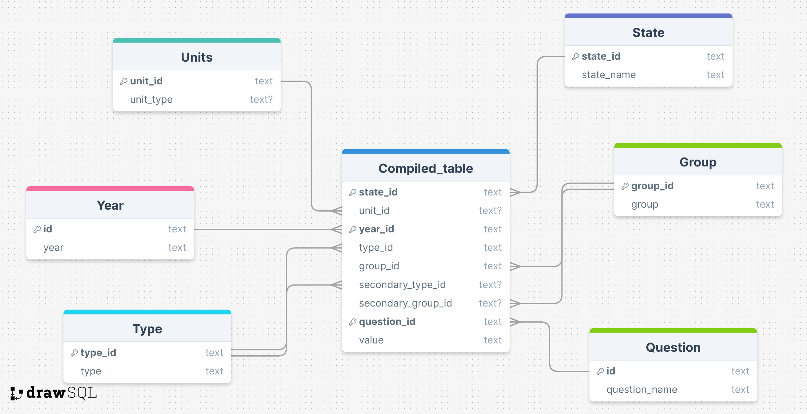

# Data
## Data Ingestion
We gathered data from two sources: KFF (which does not represent anything but is an independent source for health policy research, polling, and news)[¹³](#ref13) and County Health Rankings and Roadmaps (CHRR).[⁵](#ref5) Though we collected data across several years, we analyzed only data from 2022 due to discrepancies found across years.

### KFF: Collection and Cleaning
We generated a custom report from data available on KFF, downloading a large variety of data from 2017-2022 (not including 2020 due to lack of data collection) for each state in the U.S. Variables we investigated from this dataset included percentage of population on Medicare, percentage of adults who smoke, healthcare expenditure, median annual household income, cervical cancer incidence rate, and many more potentially relevant factors.

KFF data for each state was downloaded as CSVs. We chose the most recent dates for all of the different health and insurance-related factors between 2017-2022. The CSVs originally had a question, state, and value field. We used text parsing to create a column called demographic and a column called group. This allowed us to parse out demographics like age, race/ethnicity, poverty level and create groups within each of those. *(See below for a full working example of how we did this with the CHRR data.)*
                
We also created fields called `year` and `measure`, and parsed out the years and measurements from the question field. Some questions had multiple demographics, so we created a `secondary_demographic` field and a `secondary_group` field. These are not ranked. 

Finally, we added a `county` column (which we filled with all NA) and edited the `state` and `question` fields to replicate the way that data from our CHFF dataset was formatted. This allowed us to merge the two datasets. 

See below for examples of what our data looked like before and after cleaning.

::: {.panel-tabset}
### "Messy" data
|                                   |United States|Alabama|Alaska|Arizona|Arkansas|California|
|-----------------------------------|-------------|-------|------|-------|--------|----------|
Total Nonelderly with Medicaid, 2022|             |       |      |       |        |          |						
Medicaid                            |22.6%        |22.2%  |24.5% |22.8%  |30.4%   |28.0%     |
Nonelderly with Medicaid by Age, 2022|             |       |      |       |        |          |						
Children 0-18                       |48.1%        |60.3%  |46.6% |46.3%  |50.2%   |41.8%     |
Adults 19-64                        |51.9%        |39.7%  |53.4% |53.7%  |49.8%   |58.2%     |
Total                               |100.0%       |100.0% |100.0%|100.0% |100.0%  |100.0%    |
Nonelderly with Medicaid by Race/Ethnicity, 2022| |       |      |       |        |          |						
White                               |39.4%        |44.9%  |36.8% |30.0%  |56.3%   |18.7%     |
Black                               |19.1%        |40.0%  |N/A   |5.3%   |21.6%   |6.6%      |
Hispanic                            |29.5%        |8.7%   |9.0%  |51.2%  |10.6%   |60.1%     |
Asian/Native Hawaiian or Pacific Islander|4.7%   |1.0%   |8.3%  |1.9%   |1.3%    |10.0%     |
American Indian or Alaska Native    |1.0%         |0.3%   |26.6% |7.3%   |0.5%    |0.3%      |
Multiple Races                      |6.3%         |5.2%   |15.0% |4.3%   |9.7%    |4.3%      |
Total                               |100.0%       |100.0% |100.0%|100.0% |100.0%  |100.0%    |
Nonelderly with Medicaid by Federal Poverty Level (FPL), 2022| | | | | | |						
Under 100%                          |33.9%        |42.0%  |32.0% |34.1%  |38.7%   |27.7%     |
100-199%                            |30.6%        |30.1%  |31.2% |32.3%  |33.1%   |30.3%     |
200-399%                            |25.0%        |21.0%  |23.4% |24.0%  |22.6%   |29.0%     |
400%                                |10.5%        |6.9%   |13.5% |9.6%   |5.6%    |13.0%     |

### Cleaned data
| Question                                      | State         | Value     | Measure | Year | Demographic | Group     | Secondary Group | Secondary Demo | County |
|------------------------------------------------|---------------|-----------|---------|------|-------------|-----------|-----------------|----------------|--------|
| TOTAL NONELDERLY WITH MEDICAID, 2022 MEDICAID  | United States | 22.6      | %       | 2022 | Instances   | NA        | NA              | NA             | NA     |
| TOTAL NONELDERLY WITH MEDICAID, 2022 MEDICAID  | Alabama       | 22.2      | %       | 2022 | Instances   | NA        | NA              | NA             | NA     |
| TOTAL NONELDERLY WITH MEDICAID, 2022 MEDICAID  | Alaska        | 24.5      | %       | 2022 | Instances   | NA        | NA              | NA             | NA     |
| TOTAL NONELDERLY WITH MEDICAID, 2022 MEDICAID  | Arizona       | 22.8      | %       | 2022 | Instances   | NA        | NA              | NA             | NA     |
| TOTAL NONELDERLY WITH MEDICAID, 2022 MEDICAID  | Arkansas      | 30.4      | %       | 2022 | Instances   | NA        | NA              | NA             | NA     |
| TOTAL NONELDERLY WITH MEDICAID, 2022 MEDICAID  | California    | 28.0      | %       | 2022 | Instances   | NA        | NA              | NA             | NA     |
| TOTAL DEATHS, 2022 NUMBER OF DEATHS            | United States | 3,279,857 | NA      | 2022 | Instances   | NA        | NA              | NA             | NA     |
| TOTAL DEATHS, 2022 NUMBER OF DEATHS            | Alabama       | 62,294    | NA      | 2022 | Instances   | NA        | NA              | NA             | NA     |
| TOTAL DEATHS, 2022 NUMBER OF DEATHS            | Alaska        | 5,719     | NA      | 2022 | Instances   | NA        | NA              | NA             | NA     |
| TOTAL DEATHS, 2022 NUMBER OF DEATHS            | Arizona       | 74,082    | NA      | 2022 | Instances   | NA        | NA              | NA             | NA     |
| TOTAL DEATHS, 2022 NUMBER OF DEATHS            | Arkansas      | 37,855    | NA      | 2022 | Instances   | NA        | NA              | NA             | NA     |
| TOTAL DEATHS, 2022 NUMBER OF DEATHS            | California    | 313,161   | NA      | 2022 | Instances   | NA        | NA              | NA             | NA     |
:::

### CHRR: Collection and Cleaning
Similar to KFF, we downloaded data for each state from 2017-2022 (not including 2020 due to lack of data collection) from County Health Rankings and Roadmaps (CHRR). We chose the “20xx County Health Release National Data” links for each year as they were the CSVs with the most relevant data to our project.[⁵](#ref5) Data from CHRR originally came in two separate CSVs for each year and broke up the data by each county in the United States. This data included metrics such as `life_expectancy`, `age-adjusted_death_rate`, `years_of_potential_life_loss_rate`, `food_environment_index`, `percentage_of_physically_inactive_adults`, `percentage_of_excessive_drinking`, `Primary_Care_Provider_ratio`, and much more.²

First, we cleaned up the columns. We reviewed the documentation and renamed any potentially confusing column names. For example, `#_Medicaid_Enrollees` became `no_female_medicaid_enrollees` to avoid mistakenly believing the first column included both genders in its count. We dropped columns that would not be of help to us, such as columns containing the word `Unreliable.` We replaced all spaces with an underscore.

Second, we joined the two CSVs for each year to have one CSV per year and added a `Year` column to help with merging later.

Finally, we reformatted the CSVs to match that of the KFF data, where our original columns became the `question` column and the values filled in a new `values` column. Again, we used text parsing such as `grepl` and `gsub` to fill in our newly created `demographic`, `measure`, `group`, `secondary_demographic`, and `secondary_group`, columns. 

:::{.callout-tip collapse="true"}
# How did we do this?
For example, if our question was `mean_%_Children_in_Poverty_(white)`, our `demographic`, `group`, `secondary_demographic`, and `secondary_group` columns became "Race/Ethnicity", "White", "Age", and "0-17", respectively. See the code below for a full example.
```
chrr_2022_by_state = chrr_2022_join %>%
  pivot_longer(cols="Deaths":"%_rural", names_to = "question", values_to = "Value") %>%
  mutate(Measure = case_when(
    grepl("Income|income|spending|funding|Spending|Funding|Earning|earning", question) ~ "$",
    grepl("%|Rate|rate", question) ~ "%",
    grepl("score|Score", question) ~ "Score",
    TRUE ~ "Instance"
  )) %>%
  mutate(Demographic = case_when(
    grepl("White|Asian|Black|Hispanic|Native_Hawaiian/Other_Pacific_Islander|American_Indian|Alaskan_Native|white|asian|black|hispanic|native_hawaiian/other_pacific_islander|american_indian|alaskan_native|AIAN", question) ~ "Race/Ethnicity",
    grepl("3|4|6|7|8|9|0|Youth|Child|Adult|youth|child|adult|<|>|teen|Teen|juvenile|Juvenile", question) ~ "Age", #can't have 1 due to A1C or 2 or 5 due to PM2.5
    grepl("female|Female|male|Male|women|Women|Woman|woman|_men's|_Men's", question) ~ "Gender",
    TRUE ~ "Instances"
  )) %>% 
  mutate(Group = case_when(
    grepl("White|white", question) ~ "White", #white has to be before hispanic due to instances of "non-hispanic white"
    grepl("Asian|asian", question) ~ "Asian",
    grepl("Hispanic|hispanic", question) ~ "Hispanic",
    grepl("Black|African_American|black|african_american", question) ~ "Black",
    grepl("Native_Hawaiian/Other_Pacific_Islander|native_hawaiian/other_pacific_islander", question) ~ "Native_Hawaiian/Other_Pacific_Islander",
    grepl("American_Indian|Alaskan_Native|AIAN|american_indian|alaskan_native", question) ~ "American_Indian/Alaskan_Native",
    grepl("Youth|Child|youth|child|juvenile|Juvenile", question) ~ "0-17", #found from documentation
    grepl("Teen|teen", question) ~ "15-19",
    grepl("over_24", question) ~ "25+",
    grepl("Adult|adult", question) ~ "20-75",
    grepl("25_to_44", question) ~ "25-44",
    grepl("<_18|Less_Than_18_Years_of_Age", question) ~ "0-17",
    grepl("65_and_over|65_and_Over", question) ~ "65+",
    grepl("female|Female|woman|women|Woman|Women", question) ~ "Female",
    grepl("_men's|_Men's|_man's|_Man's", question) ~ "Male",
    TRUE ~ NA
  )) %>%
  mutate(secondary_demographic = case_when(
    Demographic == "Race/Ethnicity" & grepl("3|4|6|7|9|Youth|Child|Adult|youth|child|adult|<|>|teen|Teen|juvenile|Juvenile", question) ~ "Age",
    TRUE ~ NA
  )) %>%
  mutate(secondary_group = case_when(
    !is.na(secondary_demographic) & grepl("Youth|Child|youth|child|juvenile|Juvenile", question) ~ "0-17",
    !is.na(secondary_demographic) & grepl("Teen|teen", question) ~ "15-19",
    !is.na(secondary_demographic) & grepl("over_24", question) ~ "25+",
    !is.na(secondary_demographic) & grepl("Adult|adult", question) ~ "20-75",
    !is.na(secondary_demographic) & grepl("25_to_44", question) ~ "25-44",
    !is.na(secondary_demographic) & grepl("<_18|Less_Than_18_Years_of_Age", question) ~ "0-17",
    !is.na(secondary_demographic) & grepl("65_and_over|65_and_Over", question) ~ "65+",
  )) %>%
  mutate(Measure = as.factor(Measure),
         Demographic = as.factor(Demographic),
         Group = as.factor(Group),
         secondary_demographic = as.factor(secondary_demographic),
         secondary_group = as.factor(secondary_group))
```
:::

Since the questions and potential answers collected by CHRR data varied each year, we made sure that our cleaning code was modified for each year to accommodate the changes in the data and match identical answers from previous years. As an example, the only races that were listed as options in the 2017 data were "White", "Black", "Hispanic", and "Asian". However, by the 2022 data collection, the options had expanded to include "American Indian/Alaskan Native", "Native Hawaiian/Other Pacific Islander", and "Other/Multiple Races." In 2022, "Black" was changed to "African American," so we changed it back to "Black" to both match the earlier CHRR data and the KFF data.

See below for a sample of our pre- and post-cleaned data.

::: {.panel-tabset}
### "Messy" data
| FIPS | State   | County  | Deaths | Years_of_Potential_Life_Lost_Rate | YPLL_Rate_(AIAN) | YPLL_Rate_(Asian) | YPLL_Rate_(Black) | YPLL_Rate_(Hispanic) |
|------|---------|---------|--------|-----------------------------------|------------------|-------------------|-------------------|----------------------|
| 1000 | Alabama | NA      | 88086  | 10350                             | 5967             | 3411              | 13245             | 5244                 |
| 1001 | Alabama | Autauga | 836    | 8027                              | NA               | NA                | 11549             | NA                   |
| 1003 | Alabama | Baldwin | 3377   | 8118                              | NA               | NA                | 11603             | 4591                 |
| 1005 | Alabama | Barbour | 539    | 12877                             | NA               | NA                | 15534             | NA                   |

### Cleaned data
| State      | County   | Year | Question                          | Value | Measure | Demographic    | Group                              | Secondary Demographic | Secondary Group |
|------------|----------|------|-----------------------------------|-------|---------|----------------|------------------------------------|-----------------------|-----------------|
| Alabama    | NA       | 2022 | DEATHS                            | 88086 | Instance| Instances      | NA                                 | NA                    | NA              |
| Alabama    | NA       | 2022 | YEARS_OF_POTENTIAL_LIFE_LOST_RATE | 10350 | %       | Instances      | NA                                 | NA                    | NA              |
| Alaska     | Kusilvak | 2022 | CHILD_MORTALITY_RATE_(AIAN)       | NA    | %       | Race/Ethnicity | American_Indian/Alaskan_Native     | Age                   | 0-17            |
| Alaska     | Kusilvak | 2022 | CHILD_MORTALITY_RATE_(ASIAN)      | NA    | %       | Race/Ethnicity | Asian                              | Age                   | 0-17            |
| Arizona    | Graham   | 2022 | TEEN_BIRTH_RATE_(AIAN)            | 56    | %       | Race/Ethnicity | American_Indian/Alaskan_Native     | Age                   | 15-19           |
| Arizona    | Graham   | 2022 | TEEN_BIRTH_RATE_(ASIAN)           | NA    | %       | Race/Ethnicity | Asian                              | Age                   | 15-19           |
| Arkansas   | NA       | 2022 | %_LBW_(ASIAN)                     | 9     | %       | Race/Ethnicity | Asian                              | NA                    | NA              |
| Arkansas   | NA       | 2022 | %_LBW_(BLACK)                     | 15    | %       | Race/Ethnicity | Black                              | NA                    | NA              |
| California | Inyo     | 2022 | %_CHILDREN_IN_POVERTY_(AIAN)      | 16    | %       | Race/Ethnicity | American_Indian/Alaskan_Native     | Age                   | 0-17            |
| California | Inyo     | 2022 | %_CHILDREN_IN_POVERTY_(ASIAN)     | NA    | %       | Race/Ethnicity | Asian                              | Age                   | 0-17            |
:::

## Data Organization
Data was combined and normalized to third normal form (see <a href="./capstone_erd.png" title="Figure 1">Figure 1</a>). The ids were primary keys for each table except for `question_responses`, where `state_id`, `year_id`, and `question_id` were used as a compound primary key. We used the same foreign key for `group` and `secondary_group` and another separate foreign key for both `type` and `secondary_type`. All columns had a `NOT NULL` constraint except for `unit_type` from the `unit` table, and `unit_id`, `secondary_group_id`, and `secondary_type_id` from `question_responses`. We kept all numeric data as datatype "text" for simplicity and out of data quality concerns with PostgreSQL's numeric datatypes. We converted numbers to numeric values in R and Python.

