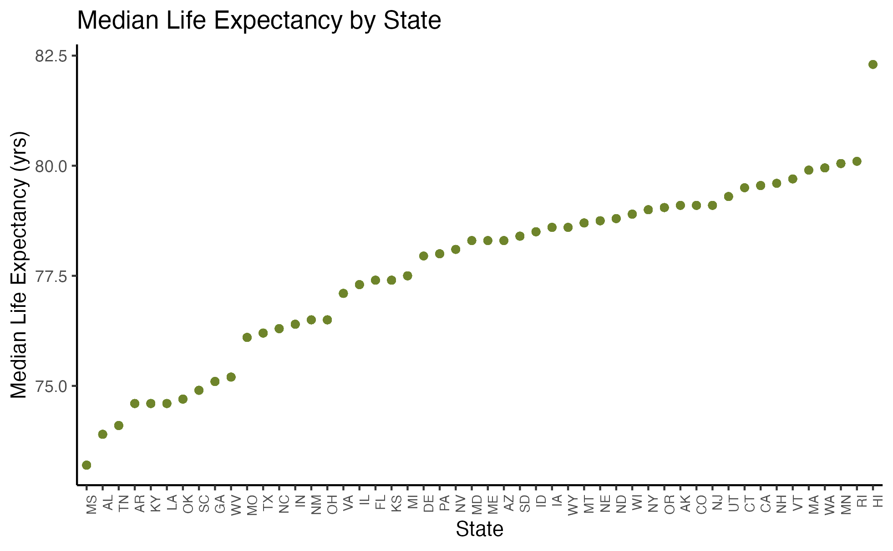
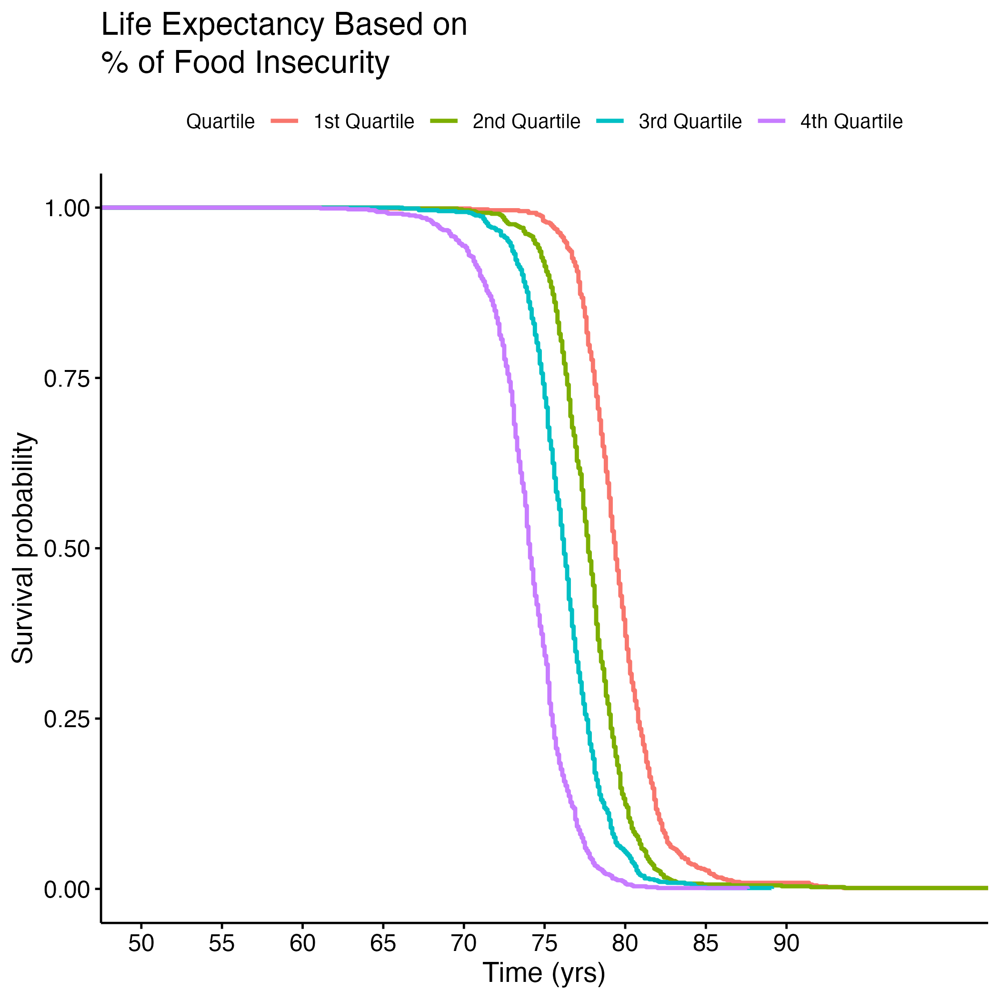
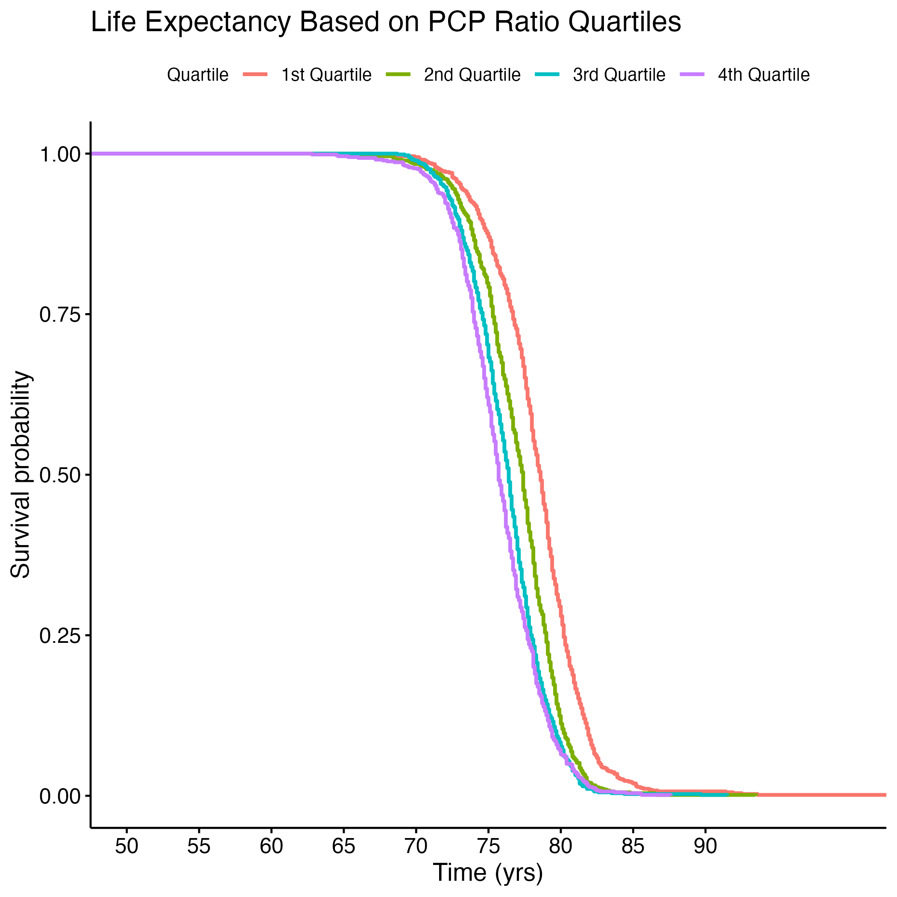
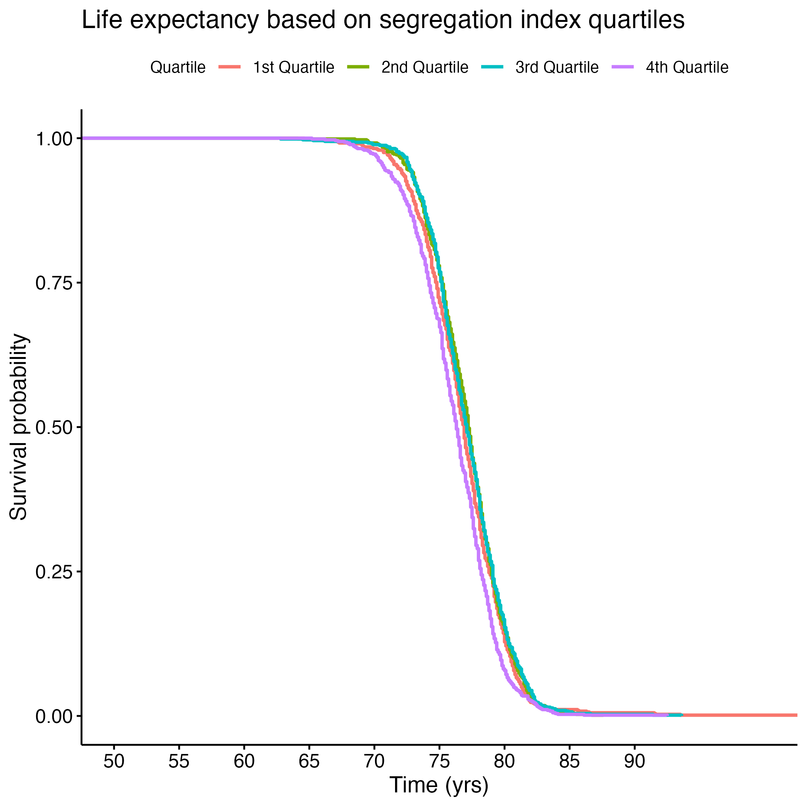
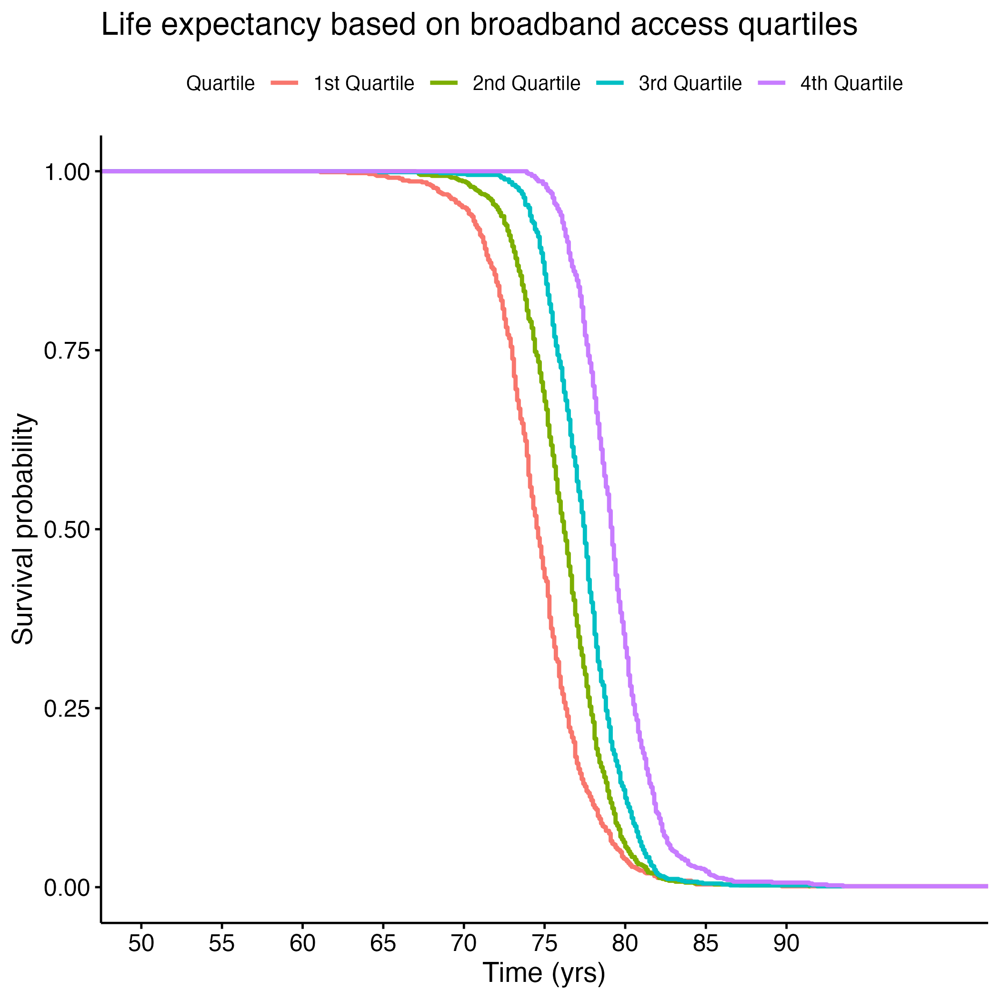
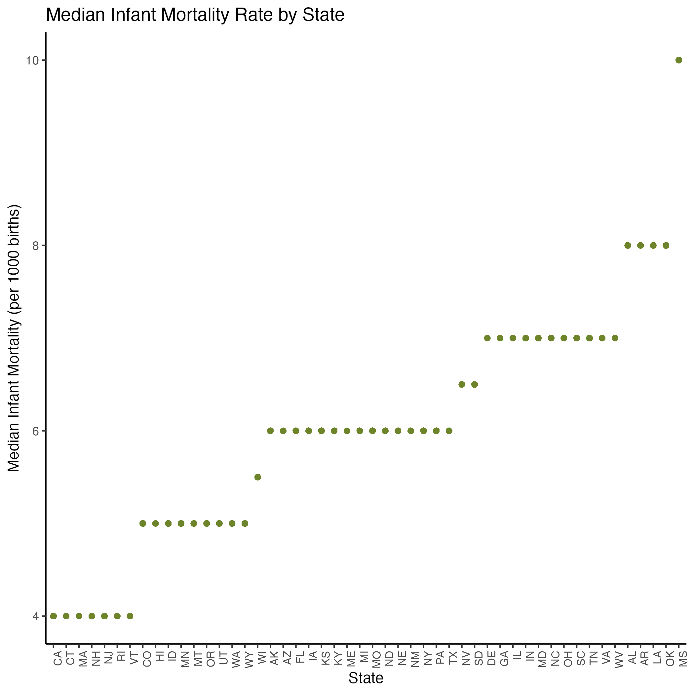
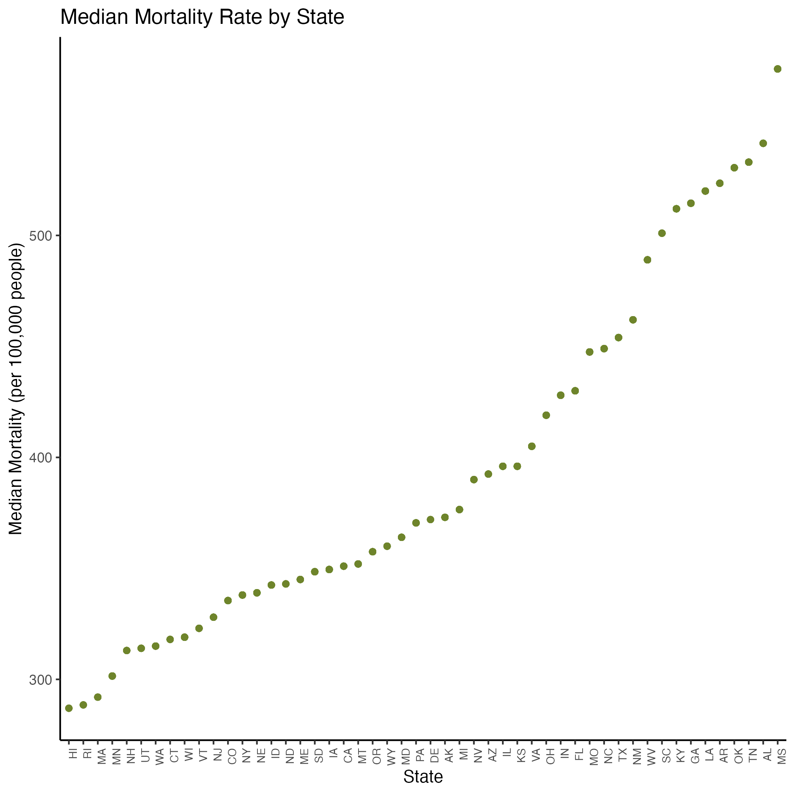
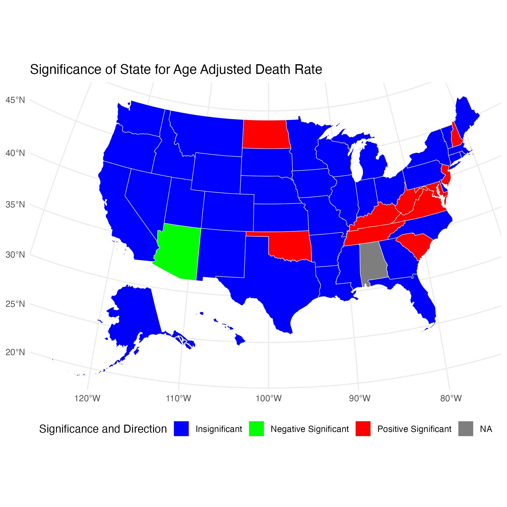
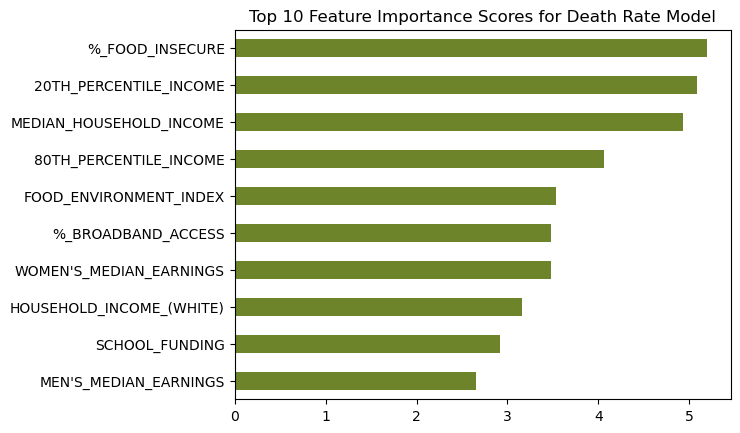

# Results

## Creating an Overall Health Quality Variable
As a novel way of assessing quality of health, we created a new variable to represent the overall health of a population. We knew that the following variables should be included in the creation of this new variable: `LIFE_EXPECTANCY`, `AGE_ADJUSTED_DEATH_RATE`, `YEARS_OF_POTENTIAL_LIFE_LOST_RATE`, `%_FREQUENT_PHYSICAL_DISTRESS`, and `%_FREQUENT_MENTAL_DISTRESS`. Reasons for choosing these variables is explained in @sec-goal1-details. A clear linear relationship is seen between each of these metrics was observed (see <a href="./Figures/pairplot.png" title="Figure 2">Figure 2</a>).

We projected these variables onto the first eigenvalue and assessed the contribution of each onto the projection. This was necessary to better interpret later analyses. We found that `YEARS_OF_POTENTIAL_LIFE_LOST_RATE` contributed to the projection by a large amount (see <a href="./Figures/first_pc_contributions.png" title="Figure 3">Figure 3</a>), which suggested that further analyses represented `YEARS_OF_POTENTIAL_LIFE_LOST_RATE` far more than the other four variables.


Next, we repeated a similar process as above to discover how much all the other variables were associated with the projection. We found the percent of population with access to exercise is most associated with the projection and chlamydia rate the least (see <a href="./Figures/overall_health_all_variables.png" title="Figure 4">Figure 4</a>). Other variables that were highly associated with the projection were preventable hospitalization rates (rate of Medicare enrollees being discharged from out-patient services), percent of homeowners, percent of kids in single-parent homes, and percent of people 65 years old or older. Since the projection is most explained by `YEARS_OF_POTENTIAL_LIFE_LOST_RATE`, this graph suggests that having access to exercise is most associated with variations in this metric. Further analysis needs to be done to confirm if a causal relationship exists between these two variables, and if so, in which directions.


Finally, we determined the projection values for each state (see <a href="./Figures/state_projection.png" title="Figure 5">Figure 5</a>). We found a clear geographic trend, where southeastern states have higher projection trends. Since the projection is most explained by `YEARS_OF_POTENTIAL_LIFE_LOST_RATE`, this data suggests southeastern states have higher rates than northwestern. Again, PCA cannot make causal claims, but only suggest associations, so @sec-goal2 was done to determine the extent of these relationships.


## Analyzing Impact of Access to Care on Health Metrics {#sec-goal2}
In order to evaluate the health status of a group of people, we turned to three common metrics for doing so: life expectancy, mortality, and infant mortality.[⁸](#ref8) In the following sections, we modeled each of these by a list of variables representing access to care (see @sec-s_table_2) and ensured there was not multicollinearity between the remaining variables and that model assumptions were met (see <a href="./images/LE_pairs.png" title="Figures S.4a">Figures S.4a</a> through <a href="./images/M_assumptions.png" title="Figure S.5C">S.5C</a>). Our goal was to determine how access to care impacted each of these three health metrics.

### Life Expectancy
Before doing any regression analysis, we were curious about the relationship between median life expectancy and state. <a href="./images/life_expectancy_by_state.png" title="Figure 6">Figure 6</a> demonstrates this relationship and reveals a clear linear association. 



When building our linear model, we narrowed down our variables to just those that significantly impacted life expectancy. We ensured the remaining variables did not exhibit multicollinearity (see <a href="./images/LE_pairs.png" title="Figures S.4A">Figures S.4A</a> and <a href="./images/LE_assumptions.png" title="Figure S.5A">S.5A</a>). [Equation @imp-life] shows our final model and @sec-s_table_3 our coefficient table for preventative healthcare measures and life expectancy. We found that Primary Care Physician (PCP) Ratio and Percentage of Access to Broadband Internet were both positively correlated with life expectancy, whereas Percentage of Food Insecurity and Segregation Index were negatively correlated with life expectancy.

::: {#imp-life .callout-warning icon=false collapse="false"}
# Equation 1: Life Expectancy Linear Model
```markdown
lm(formula = `LIFE_EXPECTANCY` ~ `state_name` + `PCP_RATIO` + 
    `%_VACCINATED_(HISPANIC)` + `AVERAGE_DAILY_PM2.5` + `%_FOOD_INSECURE` + 
    `HOUSEHOLD_INCOME_(HISPANIC)_LN` +
    `SEGREGATION_INDEX` + `%_BROADBAND_ACCESS`, data = ds_life_adjusted)
```
::: 

To better understand the survival (life expectancy) of different groups for each of these signficant variables, we created Kaplan-Meier (KM) Curves and we plotted each variable by quartile. We then conducted a log rank test to compare across quartiles to see if they were significantly different. <a href="./images/KM_food.png" title="Figure 7">Figure 7</a> shows life expectancy based on the quartile of food insecurity.



@tbl-log-rank-life shows the results of the log rank test (which are significant, as p = <2e-16 (not shown here)). Quartiles 1 and 2 (less food insecurity) observed less death than expected, but quartiles 3 and 4 (more food insecurity) observed more death than expected. This demonstrates that there exits a significant difference between life expectancy of people in the lower versus the higher quantiles of food insecurity.

| Quartile   | N   | Observed | Expected | (O-E)^2/E | (O-E)^2/V |
|------------|-----|----------|----------|-----------|-----------|
| quartile=1 | 704 | 704      | 505      | 78.411    | 98.013    |
| quartile=2 | 760 | 760      | 584      | 52.895    | 68.550    |
| quartile=3 | 757 | 757      | 745      | 0.184     | 0.254     |
| quartile=4 | 749 | 749      | 1135     | 131.551   | 230.098   |
: The observed verses expected count for each Percent Food Insecure quartile were quite different, and our p value showed these differenes were significant. This suggests those in lower quartiles of food insecurity have significantly lower life expectancies than those in higher quartiles. {#tbl-log-rank-life}

Additional Kaplan-Meier Curves for life expectancy were made for the following variables: `PCP Ratio`, `Segregation Index`, and `Percentage of Broadband Internet Access`. Log rank tests were performed for each, and all of the overall results were significant (not shown here). There were significant differences between each quartile in the `PCP Ratio` and `Percentage of Broadband Internet Access` plots, but the fourth quartile from the `Segregation Index` was the only one that was significantly different from the rest. <a href="./images/KM_PCPratio.png" title="Figure 8">Figure 8</a> shows each of the KM curves. These results suggest that lower access to care (`PCP Ratio` and `Percentage of Broadband Internet Access`) and the most segregated areas (fourth quartile of `Segregation Index`) have lower life expectancies. The rest of the KM curves can be found in section here: <a href="./images/KM_inc_hispanic.png" title="Figures S.6a">S.6a</a> through <a href="./images/KM_perc_vacc.png" title="Figure S.6E">S.6E</a>. 

::: {layout-ncol=3}
{group="km_gallery"}

{group="km_gallery"}

{group="km_gallery"}
 
:::

We then used machine learning algorithms to predict life expectancy of individuals based on these significant covariates along with the top ten features found through KBest (see <a href="./Figures/kbest_life_exp.png" title="Figure 9">Figure 9</a>). It is important to note that a lot of features were found in both the linear regression model explained above and in the KBest result. 


Our model predicted life expectancy based only on the fifteen significant access-to-care-related variables with 56% accuracy. While this may at first appear unimpressive, it’s important to realize that 56% of life expectancy can be predicted or explained by only fifteen items- all of which relate to one’s access to care. Only the remaining 44% can be explained by all other factors in a person’s life. 

### Infant Mortality 
<a href="./images/median_infant_mortality_by_state.png" title="Figure 10">Figure 10</a> shows the median infant mortality rates between states. Note that the chart appears to “stair-step” as infant mortality rates are represented as integers rather than continuous numbers. Because of the linear trend associated with each state, we included the variable in our linear model to determine which states were significantly correlated with infant mortality. 



In our statistical model of preventative healthcare measures and infant mortality (see [Equation @imp-inf] and @sec-s_table_4), we found that Median Household Income and Broadband Internet Access were significantly correlated in the negative direction with infant mortality rates. That is, as income and access to the Internet increased, infant mortality rates decreased. The Segregation Index coefficient shows that as segregation increases, infant mortality rates increase as well. (See <a href="./images/IM_pairs.png" title="Figures S.4B">Figures S.4a</a> and <a href="./images/IM_assumptions.png" title="Figure S.5B">S.5B</a> for our pairwise and assumption plots, which show that the variables we kept in our model were not correlated with each other.)

::: {#imp-inf .callout-warning icon=false collapse="false"}
# Equation 2: Infant Mortality Rate Linear Model
```markdown
lm(formula = `INFANT_MORTALITY_RATE` ~ `state_name` + `AVERAGE_DAILY_PM2.5` + 
    `MEDIAN_HOUSEHOLD_INCOME_LN` + `SEGREGATION_INDEX` + `%_BROADBAND_ACCESS`, 
    data = ds_mortality_adjusted)
```
:::

On the machine learning side, we repeated the same process for infant mortality rate as for life expectancy, but got a low accuracy score of 36% due to the high number of NAs in our Infant Mortality Rate column. Future analyses would do well to increase record-keeping of infant mortality rates by county as the metric “indicates the current health status of a population and reflects the overall state of maternal health, as well as the quality and accessibility of primary health care available to pregnant women and infants.”[⁸](#ref8) 

### Age Adjusted Death Rate


Age-adjusted death rate (mortality rate) appeared to vary across states as seen in Figure 4A, so we again kept state in our linear model. Figure 4B shows which states were significantly correlated with mortality rate. Negative correlation is in green to represent significantly lower death rates. The opposite is true for red-colored states.

See <a href="./images/M_pairs.png" title="Figures S.4C">Figures S.4C</a> and <a href="./images/M_assumptions.png" title="Figure S.5C">S.5C</a>



Preventative healthcare measures that were significantly correlated with mortality rate are shown in Figure 4C. As food insecurity, segregation, and school segregation increased, mortality rates increased as well. As broadband internet access, vaccination, and number of rural residents increased, mortality rates decreased.

Looking at demographics, we noticed as income increased among white Americans, mortality rates decreased. This income trend was the opposite among Asian and Hispanic Americans. Looking closer at the income correlation plots, the trends for Asian and Hispanic Americans appear to have more data points that could be considered outliers. As the percentage of severe housing issues increased, the mortality rate decreased, but the correlation plot appears to have outliers that could be skewing this trend as well. 

Figure 4C: Age Adjusted Death Rate (Mortality Rate) Linear Model and Coefficients:
```markdown
lm(formula = `AGE-ADJUSTED_DEATH_RATE` ~ `state_name` + `%_VACCINATED` + 
    `%_SEVERE_HOUSING_PROBLEMS` + `%_FOOD_INSECURE` + `SCHOOL_SEGREGATION_IDX` + 
    `HOUSEHOLD_INCOME_(HISPANIC)_LN` + `SEGREGATION_INDEX` + `%_BROADBAND_ACCESS` + 
    `#_RURAL_RESIDENTS` + `HOUSEHOLD_INCOME_(WHITE)_LN` + `%_VACCINATED_(ASIAN)` + 
    `HOUSEHOLD_INCOME_(ASIAN)_LN`, data = ds_mortality_adjusted)
```
| Predictor                          | Estimate  | Std. Error | t value | Pr(>\|t\|)    |
|------------------------------------|-----------|------------|---------|-------------|
| (Intercept)                        | 9.933e+02 | 1.443e+02  | 6.884   | 1.06e-11 ***|
| `%_VACCINATED`                     | -2.097e+00| 3.655e-01  | -5.737  | 1.29e-08 ***|
| `%_SEVERE_HOUSING_PROBLEMS`        | -3.190e+00| 5.191e-01  | -6.145  | 1.18e-09 ***|
| `%_FOOD_INSECURE`                  | 1.503e+01 | 9.902e-01  | 15.181  | < 2e-16 *** |
| `SCHOOL_SEGREGATION_IDX`           | 2.925e+01 | 3.784e+01  | 0.773   | 0.43979     |
| `HOUSEHOLD_INCOME_(HISPANIC)_LN`   | 1.999e+01 | 9.581e+00  | 2.086   | 0.03725 *   |
| `SEGREGATION_INDEX`                | 1.275e+00 | 2.641e-01  | 4.827   | 1.61e-06 ***|
| `%_BROADBAND_ACCESS`               | -5.696e+00| 5.048e-01  | -11.284 | < 2e-16 *** |
| `#_RURAL_RESIDENTS`                | -1.468e-05| 5.814e-06  | -2.524  | 0.01175 *   |
| `HOUSEHOLD_INCOME_(WHITE)_LN`      | -5.001e+01| 1.544e+01  | -3.239  | 0.00124 **  |
| `%_VACCINATED_(ASIAN)`             | 2.830e-01 | 2.432e-01  | 1.163   | 0.24498     |
| `HOUSEHOLD_INCOME_(ASIAN)_LN`      | 1.067e+01 | 6.013e+00  | 1.774   | 0.07641 .   |

Finally, we repeated our machine learning process to predict age-adjusted death rate based on our significant access to care covariates. Our model accurately predicted the binned death rate for 62% of our test data. Just thirteen access-to-care-related covariates predicted mortality rate 62% of the time! This again emphasizes the importance of access to care in one’s overall health status.  


